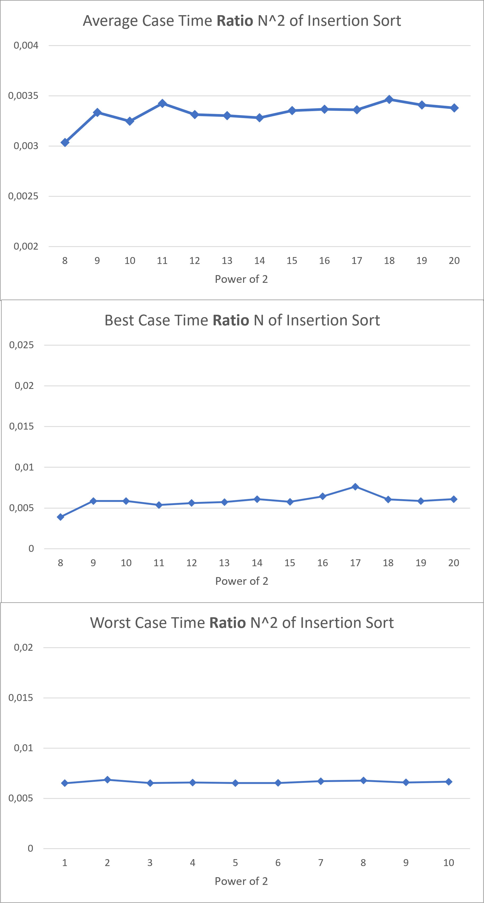
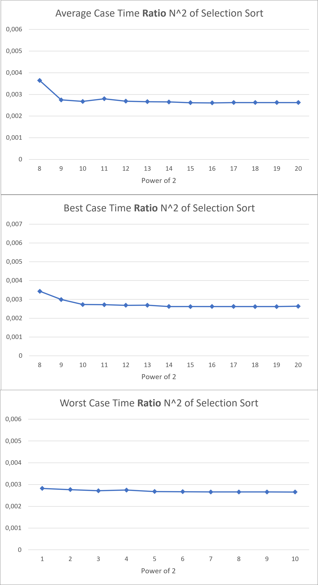
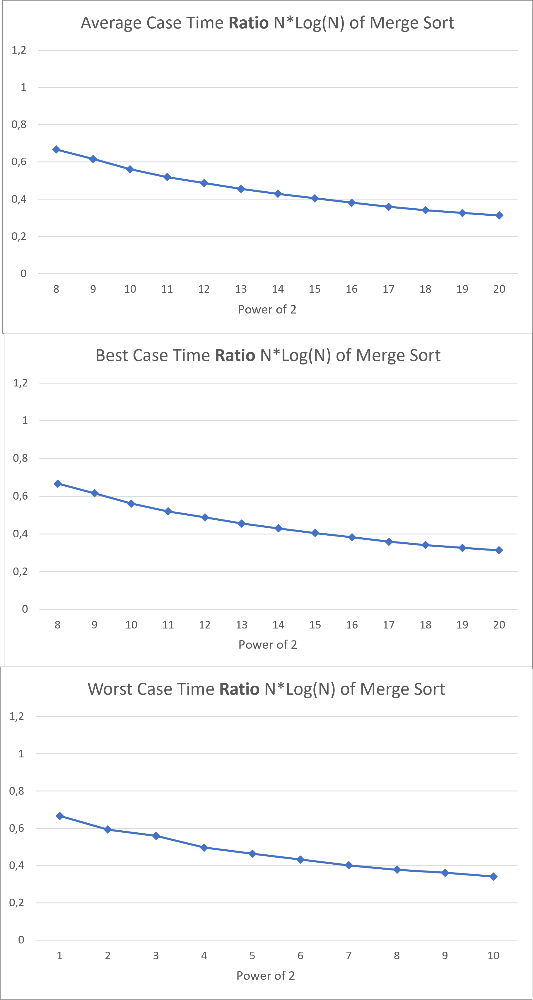
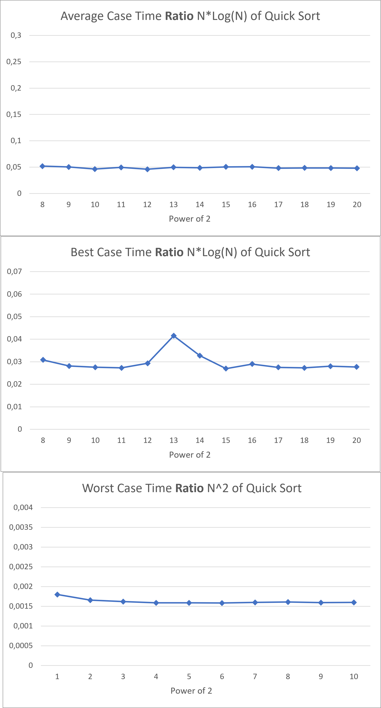
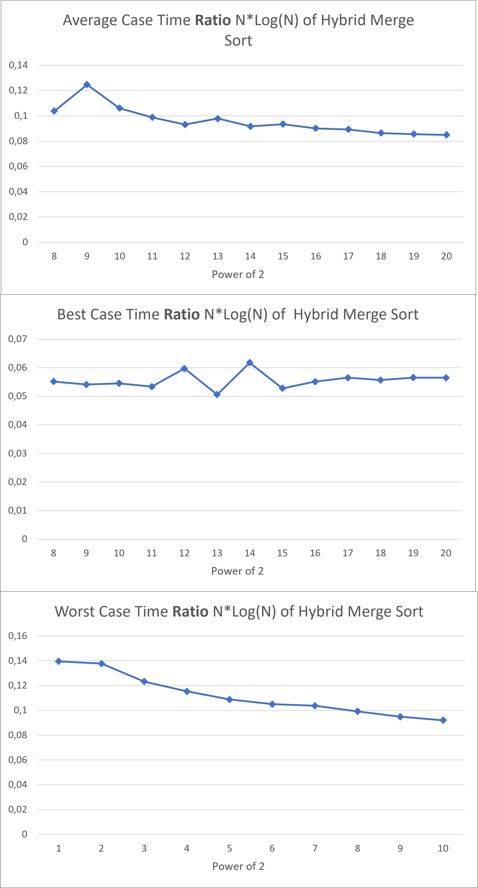
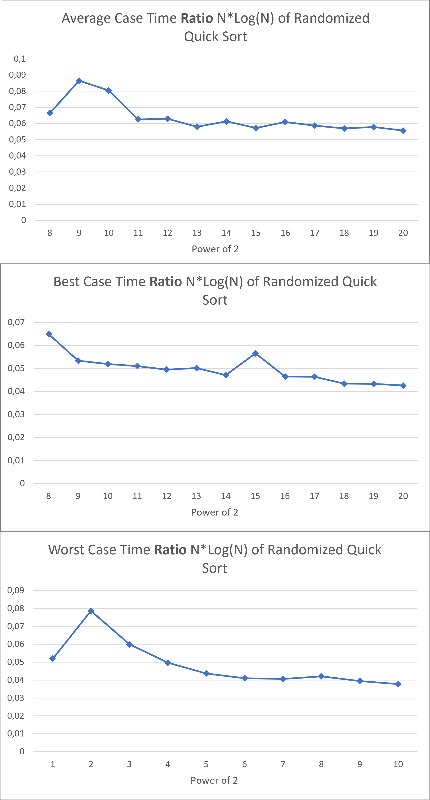
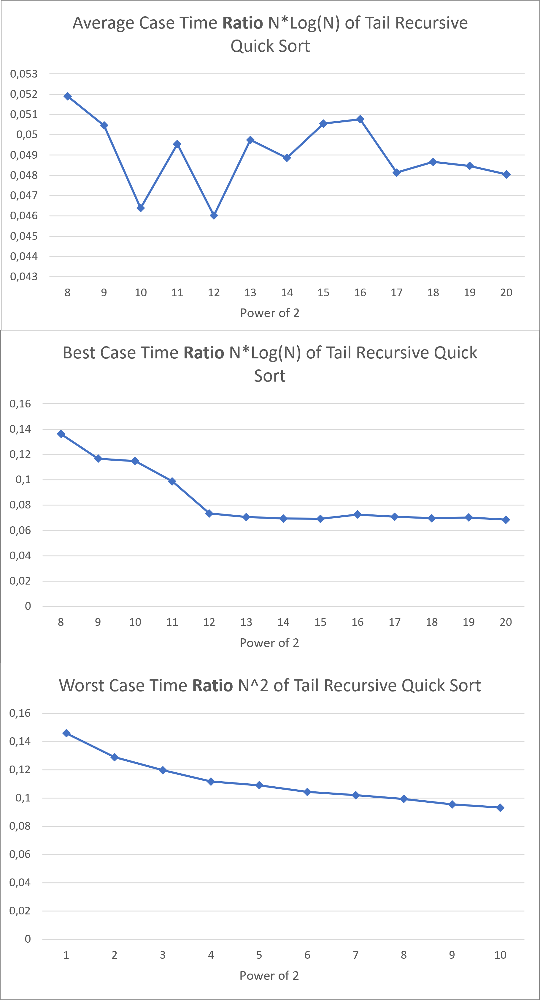
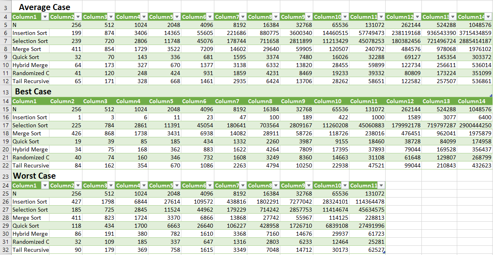

<h6><center>Juniata College - Fall Semster 2021</center></h6>
---

<h2><center> CS 315 : Writing Project 02 </center></h2>


---

<h1><center> Theorical and Experimental Review of Sort Algorithms Complexity </center></h1>


<h2><center> Victor Jung and Davit Adamashvili </center></h2>
<div style="page-break-after: always;"></div>
<center>

[TOC]

<div style="page-break-after: always;"></div>
## Introduction

In the history of the field of Computing, sorting algorithms have been studied from the very beginning, perhaps because of their simplicity. Bubble Sort, for example, was mentioned in a 1956 paper [3], however back then in was called the "Exchange Sort". As time passed, more and more sorting algorithms were invented. It was proved that comparison based sorting algorithms had time complexity $$\mathcal\Omega(n*log(n))$$, meaning they were asymptotically bounded from below by a "linearithmic" function. One of the most popular and best performing sorting algorithms, Quicksort, was invented in 1959 and published in 1961 by Tony Hoare [4]. Sorting algorithms existed even before computers were invented. Radix sort, for example, was invented 1887 by Herman Hollerith for use with tabulating machines. These machines were used for accounting and business applications [5]. Nowadays though, new and improved sorting algorithms are being invented, such as Timsort, which was invented by Tim Peters in 2002 for use in the Python programming language. It is a stable hybrid sort, using a combination of Insertion Sort and Quicksort.

Sorting algorithms are some of the most fundamental algorithms in all of Computer Science. They form the basis of many other, more complicated routines that are used in the industry. For example, the interval scheduling algorithm which is used for making optimal schedules first sorts the intervals by their finish time. The ideas from some of the sorting algorithms, like the Partition subroutine of Quicksort, can be used to create an algorithm for the K-th Order Statistic problem which runs in linear time in the average case.

Our project deals with analysing and comparing different types of sorting algorithms. We derive the running times of various sorting algorithms, compare their best and worst case scnearios and benchmark them. We use two quadratic sorts, namely Insertion and Selectrion, and two linearithmic sorts ($n*log(n)$), Mergesort and Quicksort. We also look at three additional algorithms, namely a hybrid version of Mergesort using Insertion Sort as a base case for subproblems of small size, Quicksort using a random element for partitioning and a tail recursive version of Quicksort which should reduce recursion stack overhead.


As part of this Writing Project, we have chosen to implement four famous sort algorithms, let us recall the theoretical running time bounds.

|                | Worst Case         | Average Case            | Best Case               |
| -------------- | ------------------ | ----------------------- | ----------------------- |
| Insertion Sort | $\Theta(n^2)$      | $\Theta(n^2)$           | $\Theta( n)$            |
| Selection sort | $\Theta(n^2)$      | $\Theta(n^2)$           | $\Theta(n^2)$           |
| Merge Sort     | $\Theta(n*log(n))$ | $\Theta (n*log(n))$     | $\Theta(n*log(n))$      |
| Quick Sort     | $\mathcal{O}(n^2)$ | $\mathcal{O}(n*log(n))$ | $\mathcal{O}(n*log(n))$ |

The next section will review and detail the theorical bounds of above algorithms.


## Theoretical Review

### Insertion Sort

<u>Let's consider our implementation of Insertion Sort:</u>

```c++
void insertionSort(vector<int>& v){
	for (int i = 0; i < v.size(); ++i) {
		for (int j = i; j > 0 && v[j-1] > v[j]; --j){
			swap(v[j], v[j - 1]);
		}
	}
}
```

In the **worst case**, the second loop will always go from $i$ to $0$, hence the number of swap would be: 
$$
\sum_{i=1}^{n}i=\frac{n(n+1)}{2}= \mathcal\Theta(n^2)
$$
In the **average case** if we assume that the distribution of number in the the array is uniform, then the innermost for-loop would execute $\frac{i}{2}$ swaps, thus the time complexity would be:
$$
\sum_{i=1}^{n}\frac{i}{2}=\frac{n(n+1)}{4}= \mathcal\Theta(n^2)
$$
Finally, the **best case** would be if all elements are already sorted and only one comparaison would happen at each iteration of the first for loop, resulting in a linear time complexity:
$$
\sum_{i=1}^{n}1=n= \mathcal\Theta(n)
$$

### Selection Sort

<u>We consider the following implementation of Selection Sort:</u>

```c++
void selectionSort(vector<int>& v){
	for (int i = 0; i < v.size(); i++){
		int min = i;
		for (int j = i + 1; j < v.size(); ++j){
			if (v[j] < v[min]){
				min = j;
            }
		}
		swap(v[i], v[min]);
	}
}
```

The Selection Sort time complexity for **worst and average** case are computed just like the Insertion Sort. However, the time complexity of the **best case** is also quadratic since the elements of the array does not influence the number of comparisons.

### Merge Sort

```c++
vector<int> mergesort(vector<int>& v){
	int q = v.size() / 2;
    
    // base case
	if (q == 0)
		return v;
    
	// divide array into two subarrays
	vector<int> v1(v.begin(), v.begin() + q);
	vector<int> v2(v.begin() + q, v.end());
    
    // merge the two subarrays
	v1 = mergesort(v1);
	v2 = mergesort(v2);
    
    // return the merged array
	return merge(v1, v2);
}
```

Merge sort behavior does not depend on the order of elements in the array, thus the time complexity is the same for **worst, best** and **average case**. 

To estimate this running time we use the recursive function $T(n)$:
$$
T(n)=2T(\frac{n}{2})+n\\
=2*2*T(\frac{n}{4})+\frac{2n}{2}+n\\
=2*2*2*T(\frac{n}{8})+3n\\
.\\
.\\
.\\
T(n)= 2^hT(\frac{n}{2^h}) + h*n\\
\text{Where }\frac{n}{2^h}=1 => h=lg(n)\\
\text{Hence }T(n)= 2^{lg(n)}T(1) + n*lg(n)\\
\approx n + n*log(n)\\
=\mathcal\Theta(n*log(n))
$$

### Quick Sort

<u>First let's review our implementation of the *Partition* function:</u>

```c++
int partition(vector<int>& v, int pivot, int left, int right){
	// if size of subarray is 1, it's already partitioned
	if (right - left == 1)
		return left;
    
	// for simplicity, swap pivot with the first element
	int pivot_value = v[pivot];
	swap(v[left], v[pivot]);
    
	// find first element that is greater than v[pivot]
	// during every step of the algorithm, all the elements before
	// boundary_idx are smaller than v[pivot]. v[boundary_index] is greater
	int boundary_idx = left + 1;
	while (boundary_idx < v.size() && v[boundary_idx] <= pivot_value){
		++boundary_idx;
	}
    
	// this variable just runs through the array
	int running_idx = boundary_idx + 1;
    
	while (running_idx < right){
		// keep updating the boundary
		if (v[running_idx] <= pivot_value){
			swap(v[boundary_idx], v[running_idx]);
			++boundary_idx;
		}
		++running_idx;
	}
    
	// put the pivot in the correct position
	swap(v[left], v[boundary_idx - 1]);
    
    //
	return boundary_idx - 1;
}
```

In the above code we can identify two consecutive while-loop, they will respectively do $c_1*n$ and $c_2*n$ comparisons, $c_1$ and $c_2$ being constant depending of the order of elements on the array. Hence the time complexity of our *Partition* function is $\mathcal{O}(n)$.

<u>Now we focus on the QuickSort:</u>

```c++
// sort v[left...right)
void quicksort(vector<int>& v, int left, int right){
	if (left < right){
		// choose left as pivot every time (don't randomize pivot)
		int mid = partition(v, left, left, right);
        
		// sort v[left...mid)
		quicksort(v, left, mid);
        
		// sort v[mid+1...right)
		quicksort(v, mid + 1, right);
	}
}
```

 The **best case** happened when the *Partition* function return perfectly balanced partitions, we can then write the following recurrence formula:
$$
T(n) = 2T(\frac{n}{2})+\mathcal{O}(n) = \mathcal{O}(n*log(n))
$$
This case is equivalent to the Merge Sort discussed earlier, resulting in a $\mathcal{O}(n*log(n))$ time complexity.

The **worst case** occurs when the partition are the most unbalanced (*ie:* one of the partition contain one element). We can describe this case as follow:
$$
T(n) = T(n-1)+T(1)+n\\ 
= T(n-2)+2T(1)+n+(n-1)\\
.\\
.\\
.\\
T(n)= nT(1)+\sum_{i=0}^{n}i\\
T(n)= nT(1) + \frac{n(n+1)}{2}\\
T(n)= \mathcal{O}(n^2)
$$
The **Average Case** is the most complicated to estimate, our reasoning is based on Hanan's paper [1]. Let $i$ be the size of the left partition, thus the running time $T(n)$ can be express as:
$$
T(n) = T(i)+T(n-i-1)+n
$$
We consider that $i$ is uniformely distributed in $[1;n-1]$, $n$ being the size of the array. We can now express $T(n)$ using the average of the expression defined above:
$$
T(n) = \frac{1}{n}(\sum_{i=0}^{n-1}T(i)+T(n-i-1))+n
$$
Since $\sum_{i=0}^{n-1}T(n-i-1)$ and $\sum_{i=0}^{n-1}T(i)$ represent the same amount of work we can write $T(n)$ as:
$$
T(n)=\frac{2}{n}(\sum_{i=0}^{n-1}T(i))+n
$$
After some algebraic manipulation described in detail in [1], we obtain:
$$
\frac{T(n)}{n+1}=\mathcal{O}(log(n))\\
= T(n) = \mathcal{O}(n*log(n))
$$

## Experimental Results

### Insertion Sort



Our experimental results agree with our theoretical predictions.

### Selection Sort



Again, the experimental results are not surprising.

### Merge Sort



As we can see, the predictions are a bit off. This is partly because Merge Sort has bad cache locality and because of this reason, performance might be unpredictable. Another reason is that these tests were conducted using an old version of our code where we were not preallocating memory for vectors.

### Quick Sort



As we can see, our theoretical predictions were very accurate expect an anomaly in the best case proably due to my RAM being overloaded by Google Chrome [2] while I was running this simulation.

## Above and Beyond

### Hybrid Merge Sort

```c++
// sorts v[left,right)
void insertionSort2(vector<int>& v, int left, int right)
{
	for (int i = left; i < right; ++i)
	{
		for (int j = i; j > 0 && v[j - 1] > v[j]; --j)
		{
			swap(v[j], v[j - 1]);
		}
	}
}

vector<int> hybridMergesort(vector<int>& v)
{
    // for sizes less than 43, use insertion sort
	if (v.size() <= 43)
	{
		insertionSort2(v, 0, v.size());
		return v;
	}

	int q = v.size() / 2;
	if (q == 0)
		return v;

	vector<int> v1(v.begin(), v.begin() + q);
	vector<int> v2(v.begin() + q, v.end());

	v1 = hybridMergesort(v1);
	v2 = hybridMergesort(v2);

	return merge(v1, v2);
}
```




We implemented Merge Sort with Insertion Sort as a base case for subproblems of size under a certain n. Some of the quadratic time algorithms are faster than the nlogn ones for small n.  Our choice for the base case is based on exercise 1.2-2 of our book. This exercise states that Insertion Sort runs in $n^2$  moves, whereas Merge Sort runs in $64n*log(n)$ moves. Equating these two values and using Wolfram Mathematica, we get that for $n \leq 43$, Insertion Sort if faster. It is probable that depending on implementation details and the computer architecture, this number will change.

### Randomized Quick Sort

```c++
default_random_engine dre(time(NULL));

void randomizedQuicksort(vector<int>& v, int left, int right)
{
	// we're using tail recursion
	while (left < right)
	{
		// choose random pivot
		uniform_int_distribution<int> uid(left, right - 1);
		int pivot = uid(dre);

        // partition around the random pivot
		int mid = partition(v, pivot, left, right);

		// sort left half
		randomizedQuicksort(v, left, mid);

		// move on to second half
		left = mid + 1;
	}
}
```



Using the Quicksort algorithm by randomly choosing a pivot helps with avoiding the worst case scenario. It still could happen, but chances of it happening are very slim, because it is very unlikely that we choose the smallest or the largest element in the array by random. Because of this, the worst case scenario will almost never happen. Average case and worst case scenarios remain the same. The graphs confirm the results of our analysis.

### Tail Recursive Quick Sort

```c++
void tailRecursiveQuicksort(vector<int>& v, int left, int right)
{
	while (left < right)
	{
		int mid = partition(v, left, left, right);

		// sort left half
		tailRecursiveQuicksort(v, left, mid);

		// move on to second half
		left = mid + 1;
	}
}
```



Tail recursion is basically when there is only one recursive call in the function, and the result of the recursive call is not needed when returning from the function. When this happens, the compiler can use what's called a tail call optimization, where we only use one stack frame. This basically transforms the recursive function into an iterative one. Because of this, the amount of memory used by the algorithm is reduced. Because we are not creating as many stack frames, there's less time overhead, so we can see a speedup. This can be seen from the experimental data.

## Comparative Time



## Conclusion

In this paper we reviewed and compared four different sorting algorithms and three of their variations. We provided the implementation to the abovemention algorithms in C++. In addition, we talked about the importance of sorting algorithms and gave a brief overview of the history of the sorting problem.

For future work, we might look at more modern sorting algorithms such as Timsort and Shellsort. We could also compare the cache locality of Mergesort and Quicksort. Mergesort allocates new arrays during every call, and because of this the cache locality is bad. Quicksort uses the Partition subroutine, which works inside the given array, so the parts of the memory being affected will be near each other, giving good cache locality.

Additionally, we could talk about sorting algorithms that are not comparison based, such as Counting Sort or the Pigeonhole Sort. These types of algorithms can be linear because they exploit the structure of the data, such as the array being comprised of only integers.

## Bibliography

1. http://www.hananayad.com/teaching/syde423/quickSortAvgCase.pdf

2. https://knowyourmeme.com/photos/1501182-google-chrome-ram-hog

3. https://courses.cs.duke.edu/fall03/cps182s/latex/bubble182.pdf

4. https://doi.org/10.1145%2F366622.366644

5. https://zenodo.org/record/1449699#.YXhnn5rMJPY

